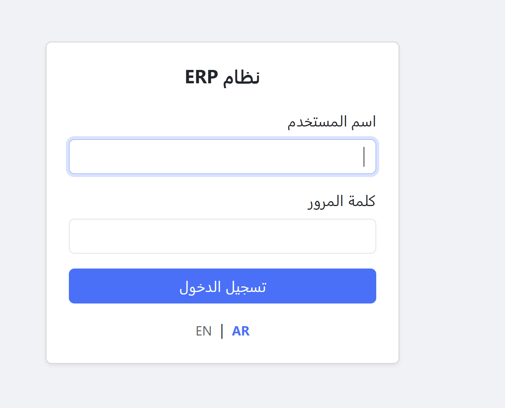
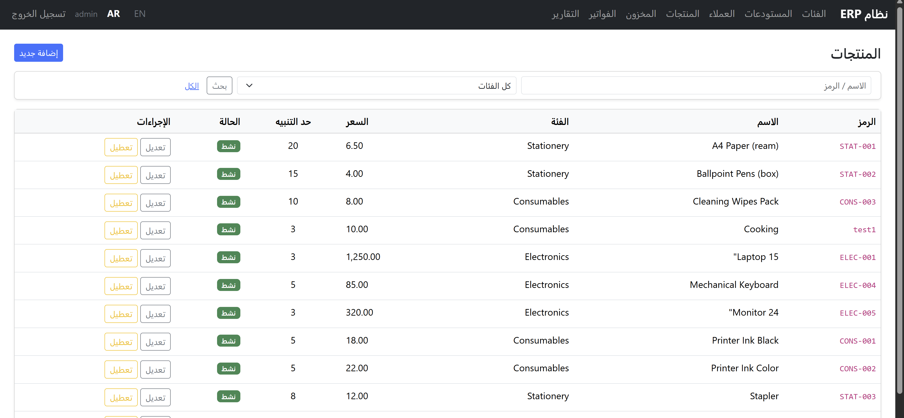
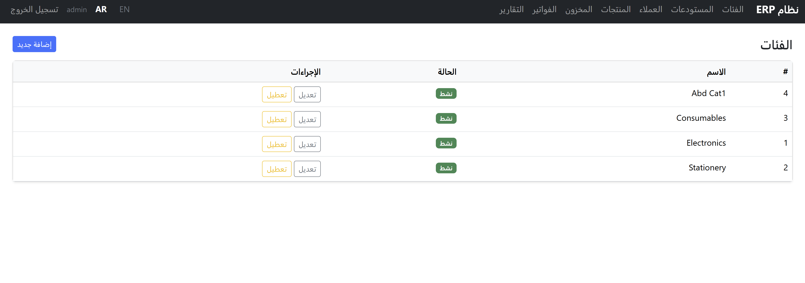
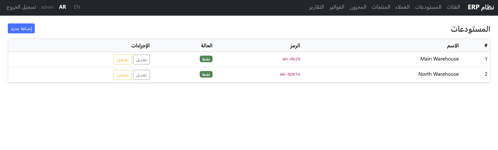
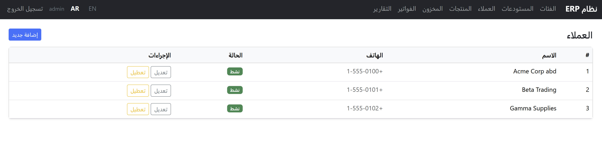
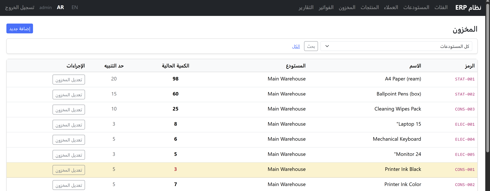
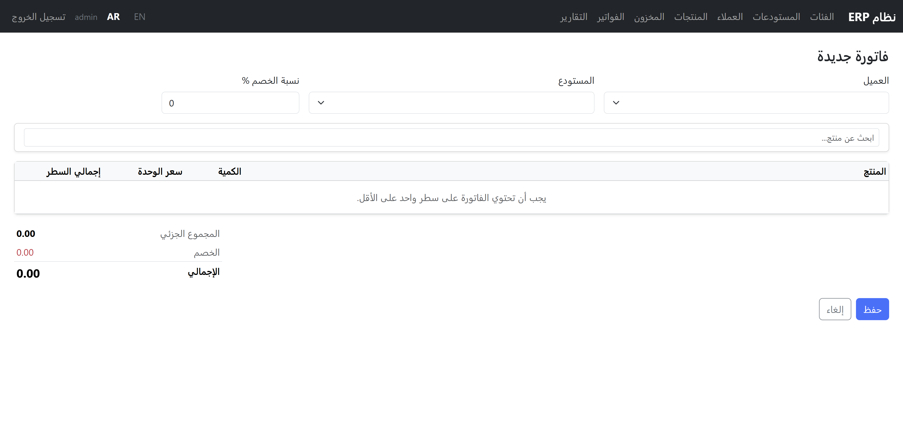
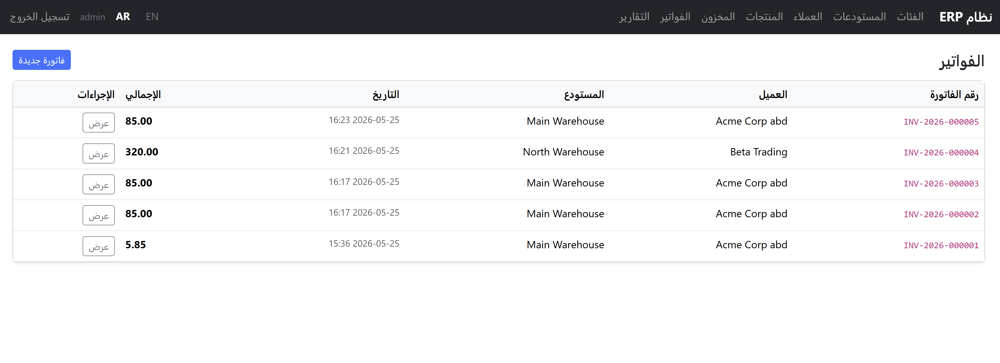
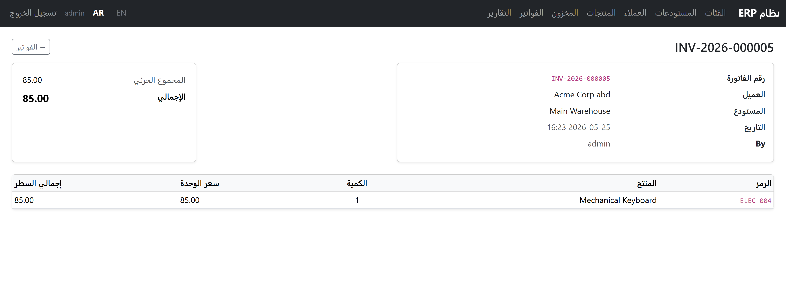

# Mini Sales & Stock ERP

CodeIgniter 3 coding test for Smart Life. Bilingual (EN/AR, RTL), role-based access, concurrency-safe stock decrement.

---

## Requirements

- PHP 7.4+
- MySQL 5.7+ or MariaDB 10.3+
- Apache with `mod_rewrite` enabled (or the built-in PHP server for quick local runs)

---

## Setup

```bash
# 1. Clone
git clone <repo-url>
cd mini_erp_stock_sales

# 2. Create the database
mysql -u root -p -e "CREATE DATABASE mini_erp CHARACTER SET utf8mb4 COLLATE utf8mb4_unicode_ci;"

# 3. Import schema then seed
mysql -u root -p mini_erp < database/schema.sql
mysql -u root -p mini_erp < database/seed.sql

# 4. Configure database connection
cp application/config/database.php.example application/config/database.php
# Edit database.php: set hostname, username, password, database = mini_erp

# 5. Set base URL
# Edit application/config/config.php line ~26:
# $config['base_url'] = 'http://localhost:8000/';

# 6. Run
php -S localhost:8000 -t .
```

Open `http://localhost:8000/` — you will be redirected to the login page.

### Apache

Point the virtual host document root at the project root. Ensure `mod_rewrite` is enabled. The included `.htaccess` removes `index.php` from all URLs.

---

## Default credentials

| Role            | Username    | Password   | Warehouse     |
|-----------------|-------------|------------|---------------|
| Admin           | `admin`     | `admin123` | all           |
| Warehouse user  | `warehouse1`| `pass123`  | Main Warehouse|
| Warehouse user  | `warehouse2`| `pass123`  | North Branch  |

---

## Screenshots

All screenshots taken in Arabic (RTL) mode.

### Login

RTL layout, Bootstrap RTL stylesheet, EN/AR switcher on the login page itself.

### Products

Paginated list with search and category filter. Active/disabled status badge. Admin sees edit and toggle-active buttons.

### Categories

Admin-only. Simple CRUD with active/disabled toggle.

### Warehouses

Admin-only. Two warehouses seeded: Main and North.

### Customers

Admin-only. Name, phone, active status.

### Stock

Current quantity in bold. Row highlighted in amber when quantity is at or below the alert threshold — Printer Ink Black (qty 3, alert 5) shown highlighted.

### New Invoice

Product autocomplete search, dynamic line rows added via JS, live subtotal/discount/total calculation. Warehouse dropdown is disabled with a hidden input for `user_warehouse` role.

### Invoice List

`INV-YYYY-NNNNNN` formatted numbers, customer, warehouse, date, total.

### Invoice Detail

Invoice header (number, customer, warehouse, date, created by) and line items with unit price and line total.

---

## Concurrency test

After importing the seed, ensure product `ELEC-004` (id=4) has exactly 1 unit in warehouse 1 (sell one first if needed), then:

```bash
php tests/concurrency_test.php
```

Expected output: `Result: 1 succeeded, 1 rejected. PASS`

---

## Documentation

All decision and architecture docs are in the `docs/` folder:

| File | Contents |
|------|----------|
| `docs/DECISIONS.md` | Done/not-done list, key decisions, concurrency explanation + test output |
| `docs/ARCHITECTURE.md` | Full developer walkthrough: schema, auth, RBAC, invoice flow, every controller and model |
| `docs/SmartLife_Plan.md` | Original build plan |
| `docs/Smart_Test.pdf` | Original brief |

---

## Notes

- `application/config/database.php` is excluded from git (see `.gitignore`). Use `database.php.example` as the template.
- Language can be switched via the `EN / AR` links in the navbar; choice is stored in the session.
- The app runs without a build step — no npm, no Composer packages beyond autoload.